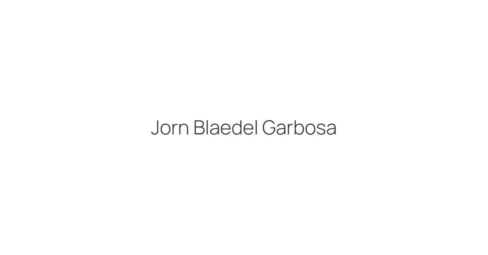

# Dance With Code

My personal [website](https://jorndoescode.lol)

## Colophon

This website is designed with a focus on minimalism, mirroring the essence of my identity and creative approach. To ensure a clean and contemporary aesthetic, I have chosen the font "Manrope" as the primary typeface throughout the website. Its modern and versatile characteristics perfectly align with the overall design philosophy.

## Influences

The design is inspired by [Benji Taylor](https://benji.org), [Manuel Moreale](https://manuelmoreale.com/), and [Hayden Bleasel](https://haydenbleasel.com/).

## Technology

- [Svelte-Kit](https://kit.svelte.dev)
- [Vite](https://vitejs.dev)
- [TailwindCSS](https://tailwindcss.com)
- [Vercel](https://vercel.com)
- [Typescript](https://www.typescriptlang.org)
